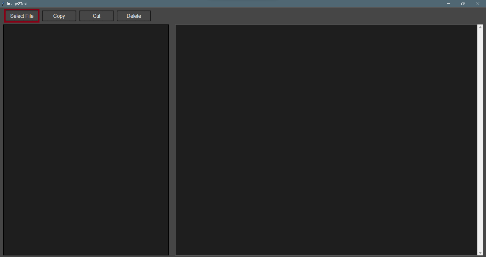
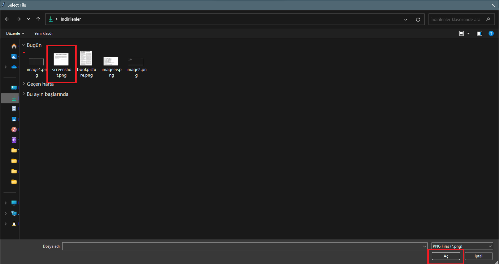
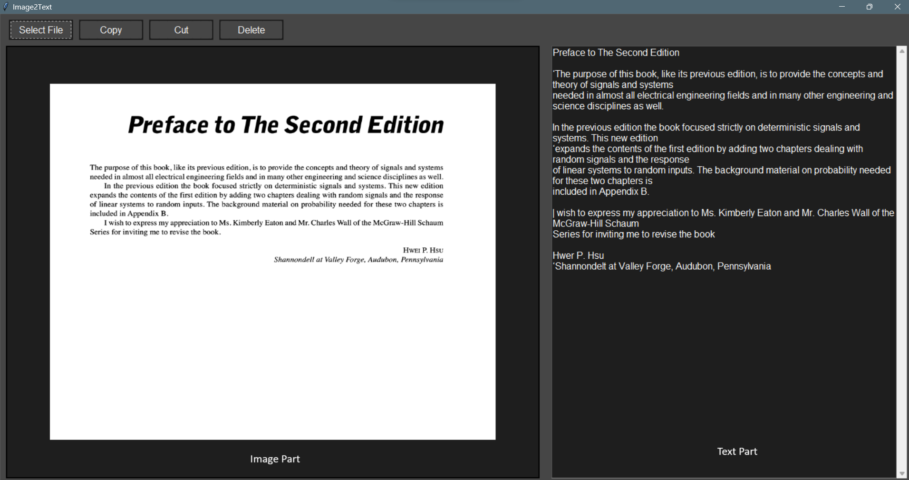

# Image Text Extractor

This program is designed to extract text from images. It supports image formats such as PNG and JPEG. By default, it can detect English words. If you download language packages for other languages, you can use them by changing the `lang` parameter to the selected language's three-character form.

### example
```bash
texta = pytesseract.image_to_string(resized_image, lang="tur")
```


## Installation

Before running the program, make sure to install the necessary libraries. You can do this by running the following commands:

```bash
pip install opencv-python
pip install pytesseract
pip install pillow
pip install pyperclip
pip install 
```


## Usage

To run the program, execute the script, and a GUI window will appear. Click the "SELECT FILE" button to choose an image file. The program will display the extracted text and the image in separate sections.

### Buttons
- **Select File:** Selects the image file for convert text.
- **Copy:** Copies the displayed text to the clipboard.
- **Cut:** Copies and deletes the displayed text.
- **Delete:** Clears the displayed text.

## Language Support

The default version of the program is set up to detect English words. If you need support for other languages, download the corresponding language packages for Tesseract OCR. You can find more information and download links on the [Tesseract GitHub page](https://github.com/tesseract-ocr/tessdoc).

**Note:** If the file extension is displayed twice, the program may encounter an error. You can turn off file extensions in your file explorer.

Feel free to contribute to the project or report issues by creating a pull request or an issue.


## Missing Parts

- Check file extensions and add/remove them if necessary.
- Add a selection button to change the 'lang' variable by choosing languages from the list in the interface.
- Utilize NLP libraries to correct misspelled words in the text, followed by applying data analysis.
- Implement visual improvements.
- Allow the user to choose the file type at the beginning, such as PDF, Word, JPEG, PNG, for example.
- A specific format image can be entered, and specific information from that image can be obtained to create a table in a CSV file.
- There is an issue about installing picture sometimes return empty.


## Example Usage

- Firstly Push Select File button and find a image includes text.





- After loading file in the left there is image part, in the right there is text part. You can use copy, delete, and cut function for text part.


